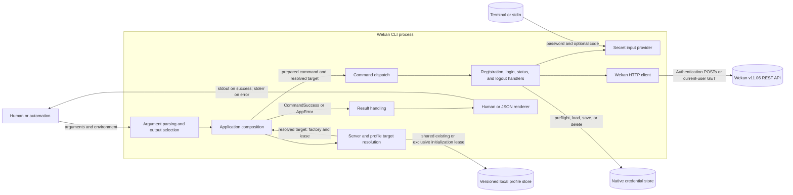
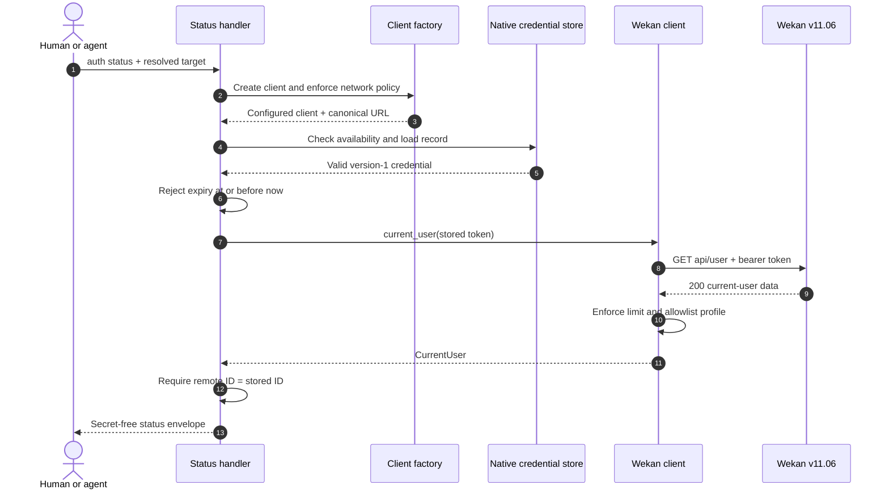
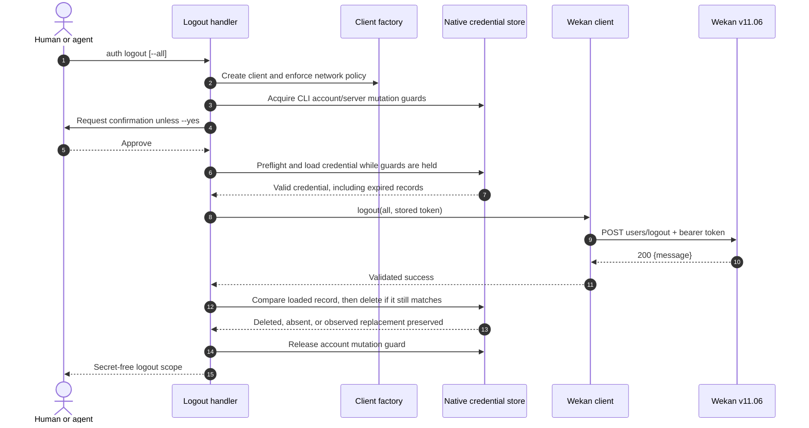
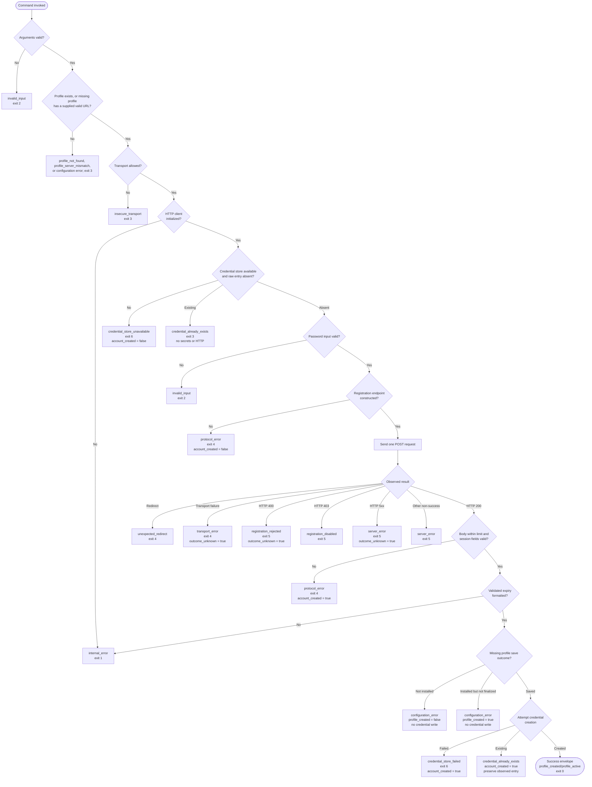
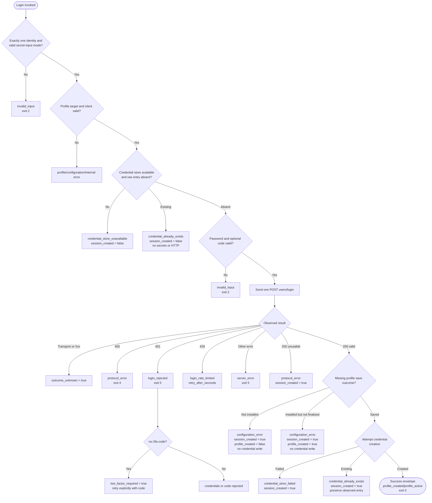
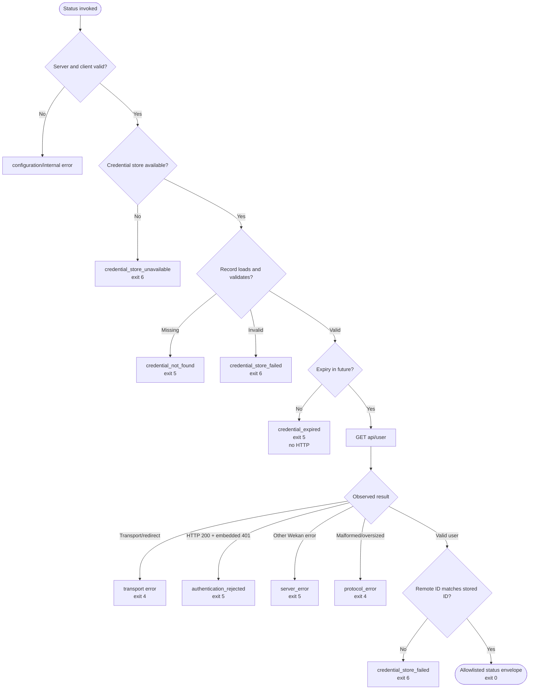
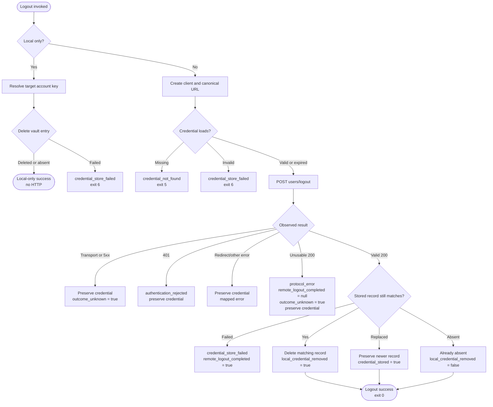
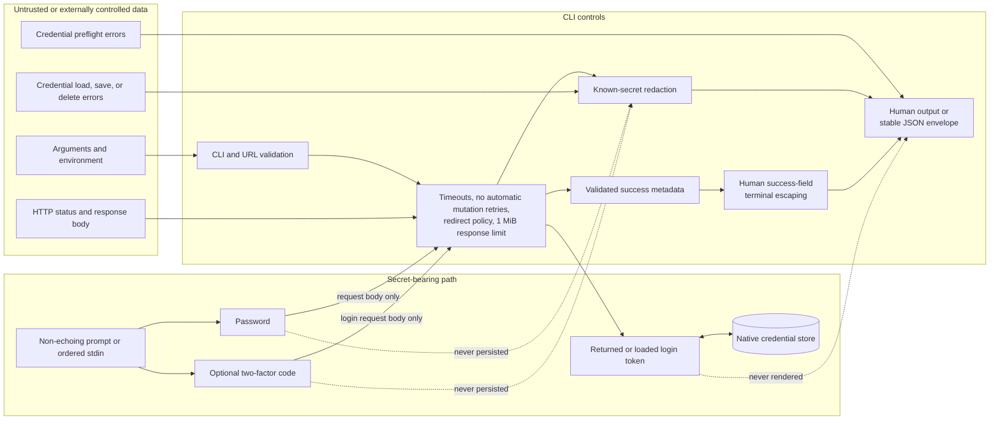
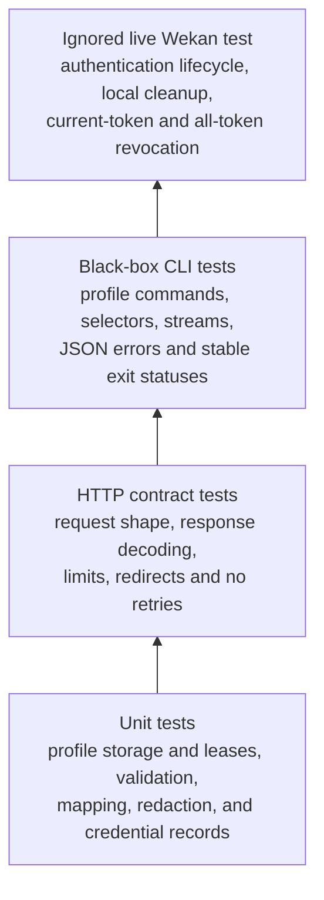

# Authentication architecture

This document describes the implemented `wekan auth register`,
`wekan auth login`, `wekan auth status`, and `wekan auth logout` slices. It
shows how command-line input becomes a Wekan request, how returned tokens cross
into and back out of the native credential store, and how success, failure, and
uncertain outcomes are reported. It also covers named-profile target resolution
and the lease that keeps profile configuration stable during authentication.

The behavioral details and stable machine contract remain authoritative in
[Authentication](auth.md) and [Agent output contract](agent-contract.md).

## System context



The application layer owns concrete production dependencies, including the
long-lived `TargetResolver`. For an authentication command, `App` asks that
resolver for a command-scoped `ResolvedTarget`, retains it through dispatch,
and passes that focused target into root routing. The `ResolvedTarget` owns its
`WekanClientFactory`, required profile identity, and retained profile guard. The
`ProfileStore`, `CredentialStore`, and `SecretInputProvider` traits keep command
behavior testable without real local configuration, a terminal, or an
operating-system vault. The HTTP client owns URL and transport policy, shared
auth-session decoding, and allowlisted current-user decoding; each handler owns
operation-specific orchestration and error mapping.

## Component responsibilities

| Boundary | Responsibility | Key implementation |
| --- | --- | --- |
| Process entry | Detect requested output before parsing, parse the CLI, select stdout or stderr, and return a stable exit status | [`src/lib.rs`](../src/lib.rs), [`src/main.rs`](../src/main.rs) |
| CLI model | Define global selectors plus the profile, registration, login, status, and logout command shapes | [`src/cli.rs`](../src/cli.rs), [`src/commands.rs`](../src/commands.rs), [`src/commands/profile.rs`](../src/commands/profile.rs), [`src/commands/auth.rs`](../src/commands/auth.rs) |
| Application composition | Construct and own long-lived dependencies, decide which commands need a target, retain each resolved target through dispatch, and pass explicit capabilities into root routing | [`src/app.rs`](../src/app.rs) |
| Configuration boundary | Persist strict named profiles; own target-selection policy; canonicalize server identity independently of network permission; and produce a command-scoped target containing its client factory and retained shared or exclusive profile guard | [`src/config.rs`](../src/config.rs), [`src/config/profiles.rs`](../src/config/profiles.rs) |
| Authentication orchestration | Enforce operation order, load or store credentials, redact secrets, and map operation-specific errors | [`src/commands/auth/`](../src/commands/auth/) |
| Command result model | Define secret-free semantic success outcomes and shared outcome vocabulary independently of rendering | [`src/command_result.rs`](../src/command_result.rs) |
| HTTP boundary | Own the canonical URL type, enforce transport permission on client creation, and apply timeouts, no redirects, no retries, and loopback proxy bypass | [`src/client.rs`](../src/client.rs), [`src/client/auth.rs`](../src/client/auth.rs) |
| Secret boundary | Read confirmed registration passwords, single login passwords, and optional two-factor codes from non-echoing prompts or ordered stdin lines | [`src/credentials.rs`](../src/credentials.rs), [`src/credentials/`](../src/credentials/) |
| Output contract | Render terminal-escaped human success fields, human errors, or stable JSON envelopes without passwords or tokens | [`src/output.rs`](../src/output.rs), [`src/error.rs`](../src/error.rs), [`src/redaction.rs`](../src/redaction.rs) |

Dependencies point inward through traits where an external side effect needs a
test seam. Command modules may orchestrate the client and credential
abstractions, while the client and credential modules do not depend on command
parsing or output rendering.

## Target resolution and credential scope

Ordinary commands resolve the profile name through `--profile`,
`WEKAN_PROFILE`, the active profile, then `default`. They independently resolve
an optional URL through `--server`, then `WEKAN_URL`; both explicit selectors
may appear together. Profile-management commands reject explicit selectors and
ignore selector environment variables.

An existing profile supplies its stored canonical server URL. A supplied URL
must canonicalize to the same value or resolution returns
`profile_server_mismatch` before vault access. A missing profile normally
returns `profile_not_found`; login and registration may instead initialize it
when a URL was supplied, after a valid Wekan session has been decoded.
`auth logout --local-only` may instead remove its orphaned vault entry when a
URL is supplied, without recreating profile metadata.

The resolved target carries the expected canonical server URL and the
profile-only native-vault account key `profile:<store-identity>:<name>`. The
opaque store identity derives from the canonical profile configuration
directory, so independently overridden configuration stores cannot collide.
Older credential formats receive no compatibility lookup or mutation.

Resolving an existing authentication target retains a shared profile-store
lease through preflight, remote work, and final vault creation or deletion.
Missing-profile login and registration retain an exclusive mutation lease
through remote authentication, profile creation, and credential creation.
Every transaction therefore acquires profile locking before credential locking.

The configuration boundary's `TargetResolver` returns a `ResolvedTarget` that
owns the `WekanClientFactory`, required profile identity, and retained lease.
The resolver canonicalizes and validates server identity independently of
network permission, without initializing an HTTP client. `App` retains the
target for the complete command and passes it explicitly into root dispatch.
Root dispatch only routes. Auth-family dispatch gives login and registration
the mutable target needed to commit a pending profile through configuration-owned
behavior, while status and logout receive only its focused factory. Command code
does not resolve profiles or construct application infrastructure. The factory
enforces plaintext HTTP permission only when a remote handler calls `create()`;
local server-scoped operations use the canonical identity without a policy
bypass.

## Successful registration sequence

```mermaid
sequenceDiagram
    autonumber
    actor Caller as Human or agent
    participant CLI as CLI entry
    participant App as Application
    participant Resolver as Target resolver
    participant Dispatch as Command dispatch
    participant Handler as Register handler
    participant Factory as Client factory
    participant Profiles as Profile store
    participant Vault as Native credential store
    participant Password as Password provider
    participant Client as Wekan client
    participant Wekan as Wekan v11.06

    Caller->>CLI: auth register + identity + target selectors
    CLI->>CLI: Parse arguments and select output format
    CLI->>App: execute(RootCommand)
    App->>Resolver: Resolve profile and optional supplied server
    Resolver->>Resolver: Canonicalize identity (no network policy)
    Resolver-->>App: ResolvedTarget (factory + retained lease)
    Note over App,Factory: Factory exists; no HTTP client yet
    App->>Dispatch: dispatch(AuthCommand + ResolvedTarget)
    Dispatch->>Handler: execute(RegisterArgs + mutable target)
    Handler->>Factory: Create client
    Factory->>Factory: Enforce network transport policy
    Factory-->>Handler: Configured client + canonical URL
    Handler->>Vault: Acquire CLI mutation guards and check raw presence
    Vault-->>Handler: Available and absent
    Handler->>Password: Read password
    Password-->>Handler: SecretString
    Handler->>Client: register(identity, password)
    Client->>Wekan: POST users/register (JSON)
    Note over Client,Wekan: Connect timeout is 10 seconds
    Note over Client,Wekan: Total timeout is 30 seconds
    Note over Client,Wekan: Redirect following and automatic retries are disabled
    Wekan-->>Client: 200 {id, token, tokenExpires}
    Client->>Client: Enforce 1 MiB limit and validate fields
    Client-->>Handler: AuthSession
    Handler->>Profiles: Persist profile if it was missing
    Profiles-->>Handler: Created/active state
    Handler->>Vault: Check then create versioned record
    Note over Handler,Vault: Account key is profile-namespaced only
    Note over Handler,Vault: The password is never stored
    Vault-->>Handler: Saved
    Handler-->>Dispatch: AuthSuccess without token
    Dispatch-->>App: AuthSuccess
    App-->>CLI: AuthSuccess
    CLI-->>Caller: stdout + exit 0
```

The raw credential-presence check deliberately happens under mutation guards,
before password input and before the remote mutation. An entry present when the
CLI checks blocks authentication without being decoded or overwritten by that
CLI invocation. The guards serialize Wekan CLI mutations, not arbitrary native
vault clients: generic OS keyring APIs do not provide a cross-process atomic
create or compare-and-swap operation. An external writer can therefore race
between the check and the CLI's write. A successful response is not reported as
success until a missing profile has been persisted and the returned token has
been created in the vault. The token remains secret throughout: it is accepted
from Wekan, wrapped as secret data, written to the vault, and omitted from both
human and JSON output.

## Successful login sequence

```mermaid
sequenceDiagram
    autonumber
    actor Caller as Human or agent
    participant Handler as Login handler
    participant Factory as Client factory
    participant Profiles as Profile store
    participant Vault as Native credential store
    participant Secrets as Secret input provider
    participant Client as Wekan client
    participant Wekan as Wekan v11.06

    Caller->>Handler: auth login + one identity + resolved target
    Handler->>Factory: Create client and enforce network policy
    Factory-->>Handler: Configured client + canonical URL
    Handler->>Vault: Acquire CLI mutation guards; check raw entry absent
    Vault-->>Handler: Available and absent
    Handler->>Secrets: Read password and optional code
    Secrets-->>Handler: LoginSecrets
    Handler->>Client: login(identity, password, optional code)
    Client->>Wekan: One POST users/login (JSON)
    Note over Client,Wekan: Redirects and retries are disabled
    Wekan-->>Client: 200 {id, token, tokenExpires}
    Client-->>Handler: Validated AuthSession
    Handler->>Profiles: Persist profile if it was missing
    Profiles-->>Handler: Created/active state
    Handler->>Vault: Check then create credential
    Vault-->>Handler: Created
    Handler-->>Caller: Secret-free success envelope
```

Interactive `--code` and automated `--code-stdin` supply the code before this
single request. The CLI does not discover two-factor authentication by replaying
a rejected password-only request.

## Successful status sequence



A missing or expired record stops before HTTP. Wekan v11.06 serializes an
invalid-token error with `statusCode: 401` inside HTTP 200; the client preserves
both statuses and the handler returns `authentication_rejected`. Status never
saves, removes, or repairs a credential. An expired or rejected entry must be
removed with `auth logout --local-only` before login can create a replacement.

## Successful logout sequences



Remote errors stop before deletion. A malformed, unreadable, or oversized HTTP
200 records the observed status but sets `remote_logout_completed: null` and
`outcome_unknown: true`, then preserves the credential. A validated 200 followed
by deletion failure reports `remote_logout_completed: true` with
`credential_store_failed`.

The native credential store uses stable, private per-user application-data
lock paths. Login, registration, remote logout, and local-only logout acquire
both a target-account guard and a canonical-server guard before their remote
request and retain them until their local save or deletion completes. That
serializes the full authentication transaction across current Wekan CLI
processes and all profiles for a server, so an all-token logout cannot retain a
token that a concurrent CLI login had already created. Logout acquires both
guards before its confirmation prompt so approval cannot race with replacement
of the selected credential by another CLI mutation.

The locks do not make a generic native-vault write or conditional deletion
atomic. OS keyring APIs offer no cross-process atomic create or
compare-and-swap operation, so a non-cooperating external writer can race the
CLI between its presence or record comparison and its write or deletion.

For `auth logout --local-only`, target resolution supplies the expected server
URL and profile-namespaced vault account. With a supplied URL, it can also
target an otherwise missing profile solely to recover its orphaned vault entry;
that path retains a read guard and never recreates profile metadata. The handler
preflights and deletes the entry without creating an HTTP client, loading the
record, or contacting Wekan. Missing entries succeed idempotently with
`local_credential_removed: false`, and output warns that no remote tokens were
revoked.

## Registration validation and outcome flow



`account_created` states what the CLI knows about the mutation. An HTTP 200
with an unusable body still means Wekan reported success, and a vault write
failure occurs after a validated success. `outcome_unknown` instead marks cases
where the request may have taken effect but the CLI cannot prove it. This is
especially important because registration is intentionally never retried.

## Login validation and outcome flow



`session_created` is the login counterpart to `account_created`. Authentication
does not replace an entry it observes during its guarded CLI transaction; a
caller must explicitly log out the profile before requesting another session.

## Status validation flow



## Logout validation flow



## Data and trust boundaries



HTTP response bodies are bounded and classified before output. When a password,
two-factor code, or token could be echoed by a remote or credential-store error,
that known secret is replaced. Terminal control characters are escaped in human success
fields, and structured JSON exposes only documented metadata. Human error
rendering does not apply a general terminal-control escaping pass.

## Verification layers


