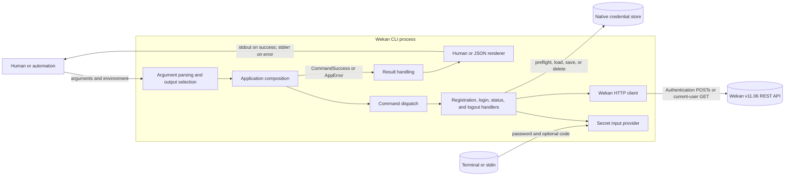
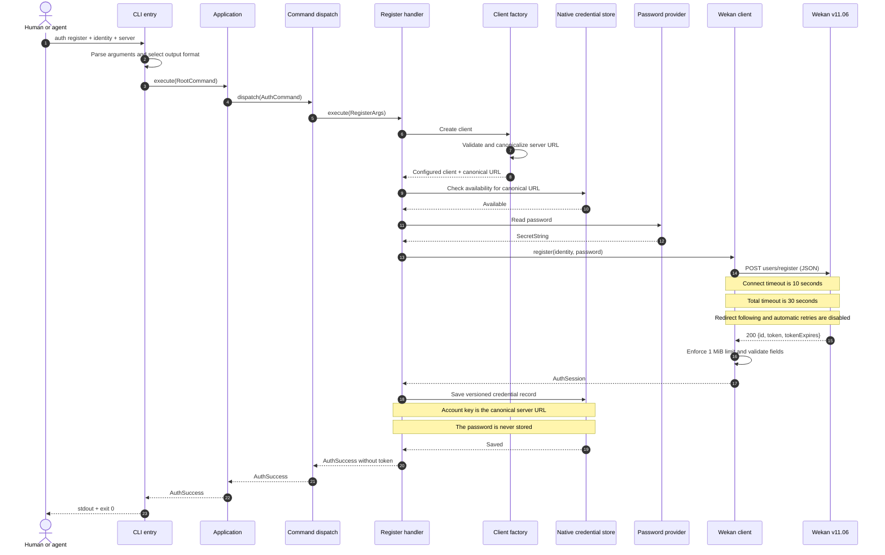
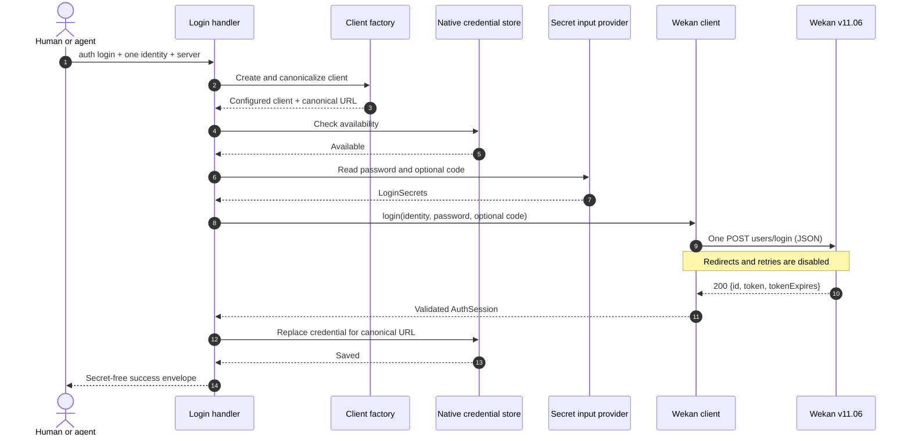
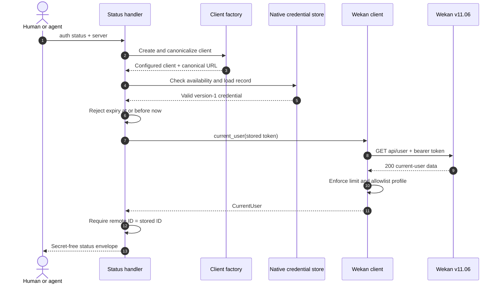
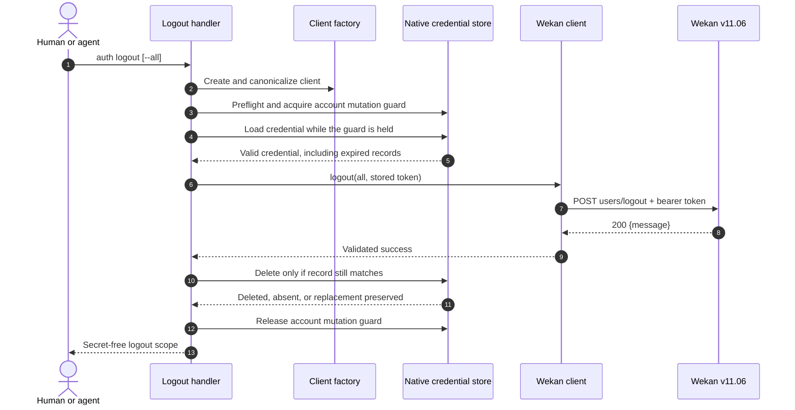
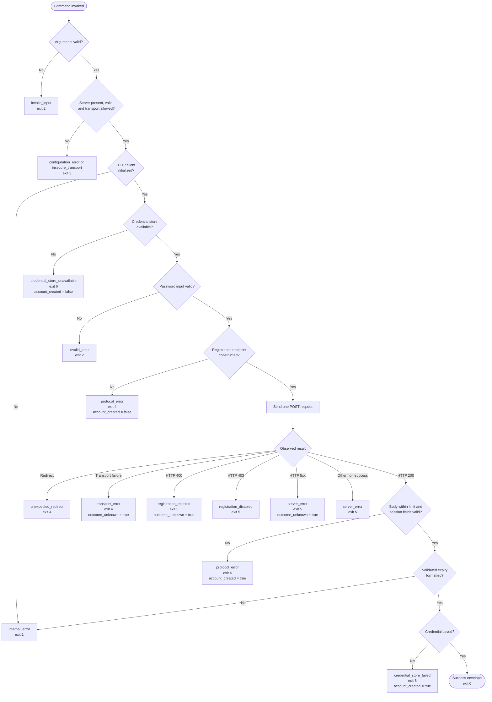
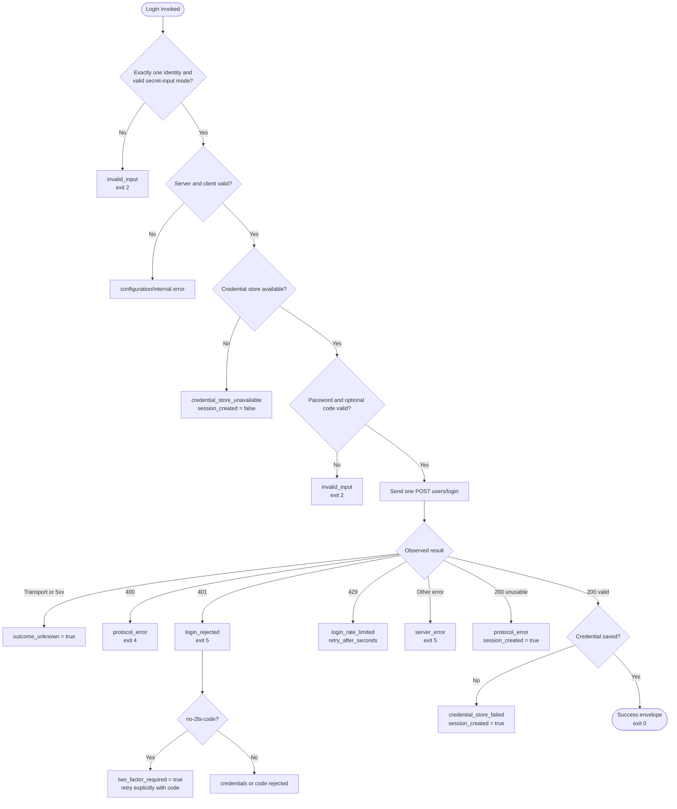
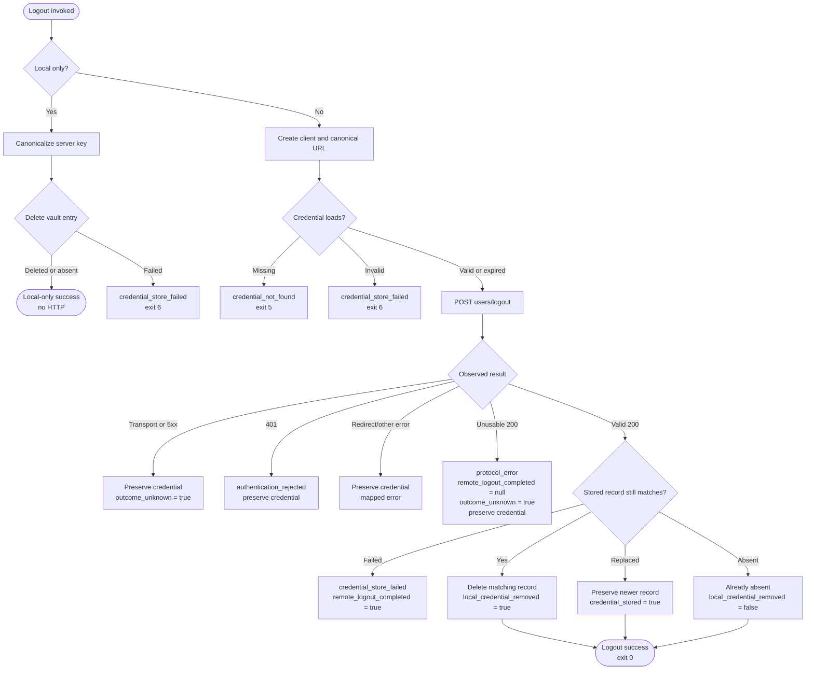
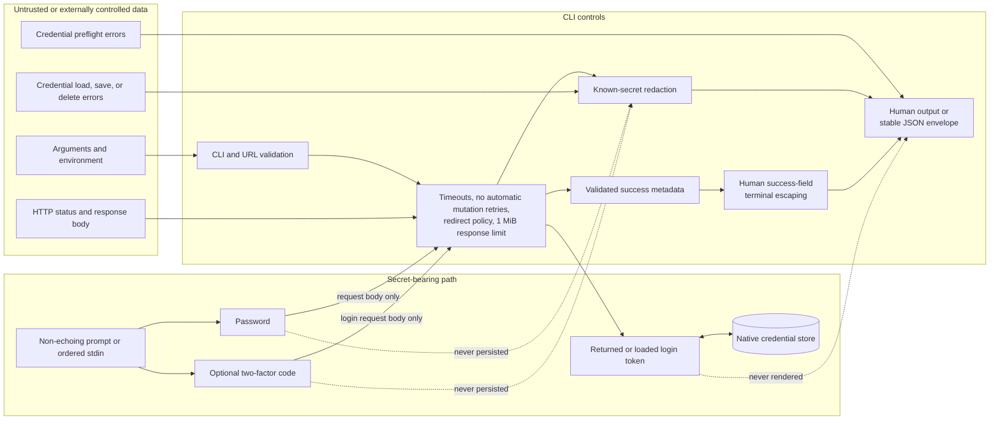
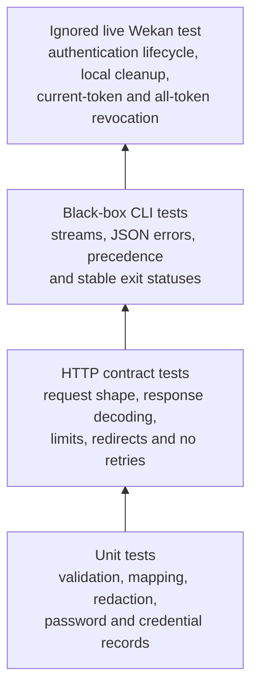

# Authentication architecture

This document describes the implemented `wekan auth register`,
`wekan auth login`, `wekan auth status`, and `wekan auth logout` slices. It
shows how command-line input becomes a Wekan request, how returned tokens cross
into and back out of the native credential store, and how success, failure, and
uncertain outcomes are reported.

The behavioral details and stable machine contract remain authoritative in
[Authentication](auth.md) and [Agent output contract](agent-contract.md).

## System context

The application layer owns concrete production dependencies and injects them
into the command handler. The `CredentialStore` and `SecretInputProvider` traits
keep command behavior testable without a real terminal or operating-system
vault. The HTTP client owns URL, transport policy, shared auth-session decoding,
and allowlisted current-user decoding; each handler owns operation-specific
orchestration and error mapping.

## Component responsibilities

| Boundary | Responsibility | Key implementation |
| --- | --- | --- |
| Process entry | Detect requested output before parsing, parse the CLI, select stdout or stderr, and return a stable exit status | [`src/lib.rs`](../src/lib.rs), [`src/main.rs`](../src/main.rs) |
| CLI model | Define global flags plus the registration, login, status, and logout command shapes | [`src/cli.rs`](../src/cli.rs), [`src/commands.rs`](../src/commands.rs), [`src/commands/auth.rs`](../src/commands/auth.rs) |
| Application composition | Construct production dependencies and pass them into dispatch | [`src/app.rs`](../src/app.rs) |
| Authentication orchestration | Enforce operation order, load or store credentials, redact secrets, and map operation-specific errors | [`src/commands/auth/`](../src/commands/auth/) |
| Command result model | Define secret-free semantic success outcomes and shared outcome vocabulary independently of rendering | [`src/command_result.rs`](../src/command_result.rs) |
| HTTP boundary | Canonicalize and validate the server URL; apply timeouts, no redirects, no retries, and loopback proxy bypass | [`src/client.rs`](../src/client.rs), [`src/client/auth.rs`](../src/client/auth.rs) |
| Secret boundary | Read confirmed registration passwords, single login passwords, and optional two-factor codes from non-echoing prompts or ordered stdin lines | [`src/credentials.rs`](../src/credentials.rs), [`src/credentials/`](../src/credentials/) |
| Output contract | Render terminal-escaped human success fields, human errors, or stable JSON envelopes without passwords or tokens | [`src/output.rs`](../src/output.rs), [`src/error.rs`](../src/error.rs), [`src/redaction.rs`](../src/redaction.rs) |

Dependencies point inward through traits where an external side effect needs a
test seam. Command modules may orchestrate the client and credential
abstractions, while the client and credential modules do not depend on command
parsing or output rendering.

## Successful registration sequence

The credential-store preflight deliberately happens before password input and
before the remote mutation. A successful response is not reported as success
until the returned token has been stored. The token remains secret throughout:
it is accepted from Wekan, wrapped as secret data, written to the vault, and
omitted from both human and JSON output.

## Successful login sequence

Interactive `--code` and automated `--code-stdin` supply the code before this
single request. The CLI does not discover two-factor authentication by replaying
a rejected password-only request.

## Successful status sequence

A missing or expired record stops before HTTP. Wekan v11.06 serializes an
invalid-token error with `statusCode: 401` inside HTTP 200; the client preserves
both statuses and the handler returns `authentication_rejected`. Status never
saves, removes, or repairs a credential.

## Successful logout sequences

Remote errors stop before deletion. A malformed, unreadable, or oversized HTTP
200 records the observed status but sets `remote_logout_completed: null` and
`outcome_unknown: true`, then preserves the credential. A validated 200 followed
by deletion failure reports `remote_logout_completed: true` with
`credential_store_failed`.

The native credential store uses a stable, private per-user application-data
lock path. Login, registration, remote logout, and local-only logout acquire
the same canonical-server guard before their remote request and retain it until
their local save or deletion completes. That serializes the full authentication
transaction across current CLI processes, so an all-token logout cannot retain
a token that a concurrent login had already created.

For `auth logout --local-only`, the factory only canonicalizes the configured
server URL. The handler preflights and deletes the vault entry without creating
an HTTP client, loading the record, or contacting Wekan. Missing entries succeed
idempotently with `local_credential_removed: false`, and output warns that no
remote tokens were revoked.

## Registration validation and outcome flow

`account_created` states what the CLI knows about the mutation. An HTTP 200
with an unusable body still means Wekan reported success, and a vault write
failure occurs after a validated success. `outcome_unknown` instead marks cases
where the request may have taken effect but the CLI cannot prove it. This is
especially important because registration is intentionally never retried.

## Login validation and outcome flow

`session_created` is the login counterpart to `account_created`. Local
credential replacement does not revoke any older tokens that Wekan has issued.

## Status validation flow

## Logout validation flow

## Data and trust boundaries

HTTP response bodies are bounded and classified before output. When a password,
two-factor code, or token could be echoed by a remote or credential-store error,
that known secret is replaced. Terminal control characters are escaped in human success
fields, and structured JSON exposes only documented metadata. Human error
rendering does not apply a general terminal-control escaping pass.

## Verification layers

