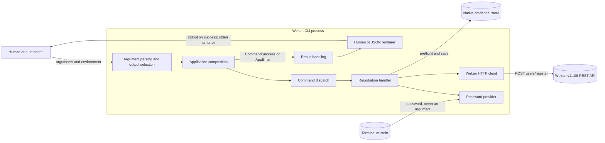
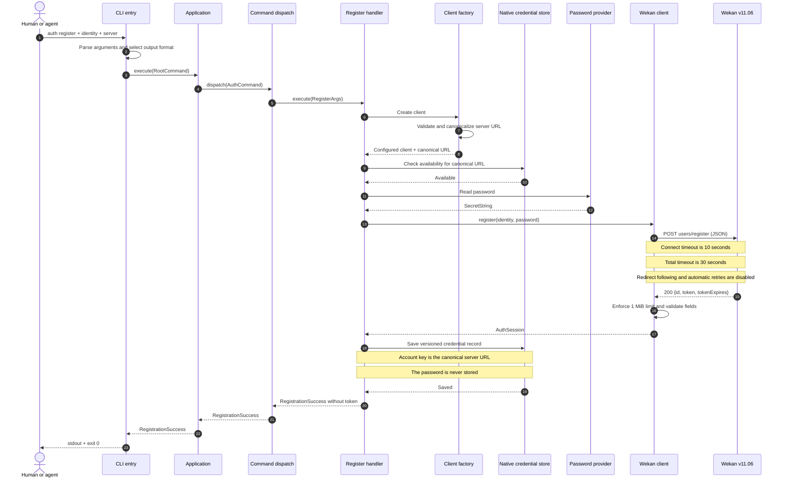
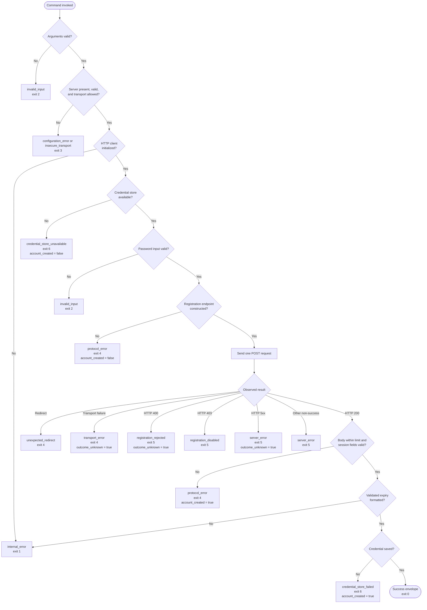
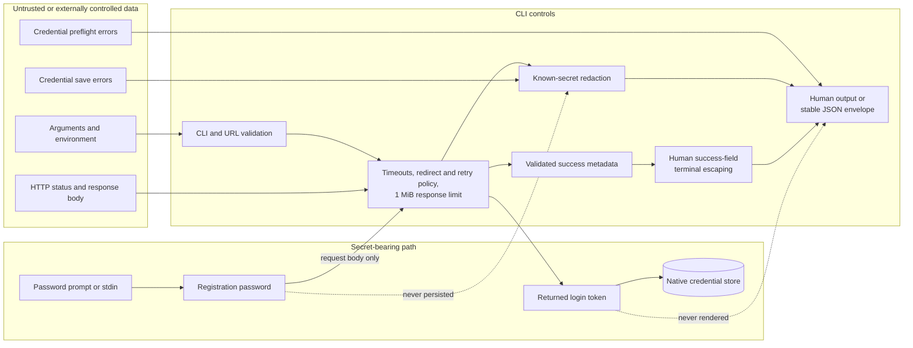
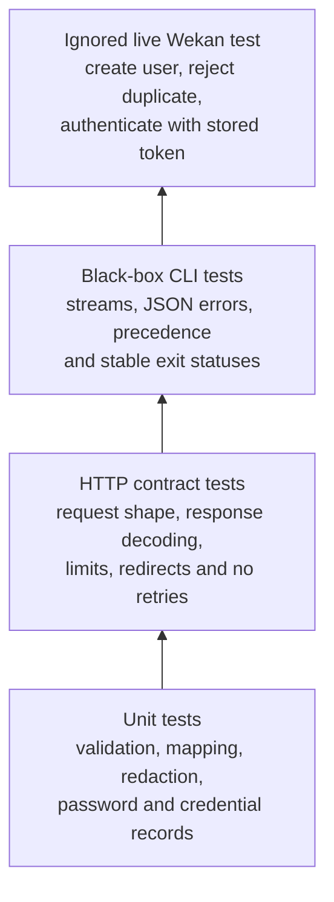

# Authentication registration architecture

This document describes the implemented `wekan auth register` slice. It shows
how command-line input becomes one non-idempotent Wekan request, how the
returned login token crosses the process boundary into the native credential
store, and how success, failure, and uncertain outcomes are reported.

The behavioral details and stable machine contract remain authoritative in
[Authentication](auth.md) and [Agent output contract](agent-contract.md).

## System context

The application layer owns concrete production dependencies and injects them
into the command handler. The `CredentialStore` and `PasswordProvider` traits
keep command behavior testable without a real terminal or operating-system
vault. The HTTP client owns URL and transport policy; the registration handler
owns orchestration, error mapping, and mutation-state metadata.

## Component responsibilities

| Boundary | Responsibility | Key implementation |
| --- | --- | --- |
| Process entry | Detect requested output before parsing, parse the CLI, select stdout or stderr, and return a stable exit status | [`src/lib.rs`](../src/lib.rs), [`src/main.rs`](../src/main.rs) |
| CLI model | Define global server, output, and insecure-HTTP flags plus the `auth register` command shape | [`src/cli.rs`](../src/cli.rs), [`src/commands.rs`](../src/commands.rs), [`src/commands/auth.rs`](../src/commands/auth.rs) |
| Application composition | Construct production dependencies and pass them into dispatch | [`src/app.rs`](../src/app.rs) |
| Registration orchestration | Enforce operation order, construct the request, store credentials, redact secrets, and map errors | [`src/commands/auth/register.rs`](../src/commands/auth/register.rs) |
| HTTP boundary | Canonicalize and validate the server URL; apply timeouts, no redirects, no retries, and loopback proxy bypass | [`src/client.rs`](../src/client.rs), [`src/client/auth.rs`](../src/client/auth.rs) |
| Secret boundary | Read a password from a non-echoing prompt or one stdin line and persist only the returned token in the native vault | [`src/credentials.rs`](../src/credentials.rs), [`src/credentials/`](../src/credentials/) |
| Output contract | Render terminal-escaped human success fields, human errors, or stable JSON envelopes without passwords or tokens | [`src/output.rs`](../src/output.rs), [`src/error.rs`](../src/error.rs), [`src/redaction.rs`](../src/redaction.rs) |

Dependencies point inward through traits where an external side effect needs a
test seam. Command modules may orchestrate the client and credential
abstractions, while the client and credential modules do not depend on command
parsing or output rendering.

## Successful registration sequence

The credential-store preflight deliberately happens before password input and
before the remote mutation. A successful response is not reported as success
until the returned token has been stored. The token remains secret throughout:
it is accepted from Wekan, wrapped as secret data, written to the vault, and
omitted from both human and JSON output.

## Validation and outcome flow

`account_created` states what the CLI knows about the mutation. An HTTP 200
with an unusable body still means Wekan reported success, and a vault write
failure occurs after a validated success. `outcome_unknown` instead marks cases
where the request may have taken effect but the CLI cannot prove it. This is
especially important because registration is intentionally never retried.

## Data and trust boundaries

HTTP response bodies are bounded and classified before output. When a password
or token could be echoed by a remote or credential-store error, that known
secret is replaced. Terminal control characters are escaped in human success
fields, and structured JSON exposes only documented metadata. Human error
rendering does not apply a general terminal-control escaping pass.

## Verification layers

